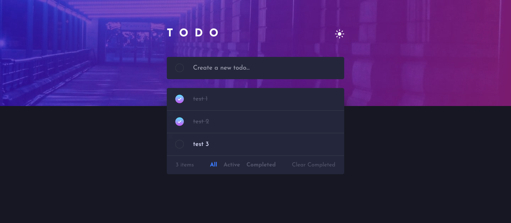

# Frontend Mentor - Todo app solution

This is a solution to the [Todo app challenge on Frontend Mentor](https://www.frontendmentor.io/challenges/todo-app-Su1_KokOW). Frontend Mentor challenges help you improve your coding skills by building realistic projects.

## Table of contents

- [Overview](#overview)
  - [The challenge](#the-challenge)
  - [Screenshot](#screenshot)
  - [Links](#links)
- [My process](#my-process)
  - [Built with](#built-with)
  - [What I learned](#what-i-learned)
  - [Continued development](#continued-development)
  - [Useful resources](#useful-resources)
- [Author](#author)
- [Acknowledgments](#acknowledgments)

**Note: Delete this note and update the table of contents based on what sections you keep.**

## Overview

### The challenge

Users should be able to:

- View the optimal layout for the app depending on their device's screen size
- See hover states for all interactive elements on the page
- Add new todos to the list
- Mark todos as complete
- Delete todos from the list
- Filter by all/active/complete todos
- Clear all completed todos
- Toggle light and dark mode

### Screenshot




### Links

- Solution URL: [https://github.com/HusamAjour/to-do](https://github.com/HusamAjour/to-do)
- Live Site URL: [https://todo.husamajour.dev/](https://todo.husamajour.dev/)

## My process

### Built with

- Semantic HTML5 markup
- CSS custom properties
- Flexbox
- CSS Grid
- Mobile-first workflow

### What I learned

I was comfortable with this project overall but there was one thing that I've never done before which is setting a linear gradient as a border. This part was challenging bu I learned how to do it for elements with border radius and the elements without.

To do it for element with border radius:

```css
.element {
  border-image: linear-gradient(hsl(192, 100%, 67%), hsl(280, 87%, 65%)) 1;
  border-width: 1px;
  border-style: solid;
  border-color: transparent;
  }
```

To do it for element without border radius:

```css
.element {
  background: linear-gradient(hsl(0, 0%, 100%), hsl(0, 0%, 100%)) padding-box,
    linear-gradient(hsl(192, 100%, 67%), hsl(280, 87%, 65%)) border-box;
  border-width: 1px;
  border-style: solid;
  border-color: transparent;
  }
```

### Useful resources

- [Gradient Borders](https://codyhouse.co/nuggets/css-gradient-borders) - This helped me to learn how to set a linear gradient as a border.
- [W3Schools](https://www.w3schools.com/) - This helped me to review some JavaScript basics such as how to get an element id and other similar things.

## Author

- Website - [Husam Ajour](https://husamajour.dev)
- Frontend Mentor - [@HusamAjour](https://www.frontendmentor.io/profile/HusamAjour)
- Twitter - [@HusamAjour](https://twitter.com/HusamAjour)
